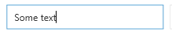

# EditorTextBox

EditorTextBox is a TextBox that supports [markdown](https://github.com/adam-p/markdown-here/wiki/Markdown-Cheatsheet).
Fair warning, markdown support is not complete yet.

```xaml
<metrolib:EditorTextBox Watermark="Click me!" />
```



