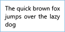

# EditorTextBox  

A textbox meant to edit text.
                Displays a watermark while no text has been entered.

Supports many markdown shortcuts, when EnableMarkdownShortcuts is set to true.
                See https://github.com/adam-p/markdown-here/wiki/Markdown-Cheatsheet.

**Namespace**: Metrolib.Controls  
**Assembly**: Metrolib (in Metrolib.dll)  

### Unfocused

```xaml
<Metrolib:EditorTextBox Watermark="Enter comment..." />
```


### Focused

```xaml
<Metrolib:EditorTextBox Watermark="Enter comment..." />
```


### Text, Focused

```xaml
<Metrolib:EditorTextBox Text="The quick brown fox jumps over the lazy dog" Watermark="Enter comment..." TextWrapping="Wrap" />
```


### Text, Unfocused

```xaml
<Metrolib:EditorTextBox Text="The quick brown fox jumps over the lazy dog" Watermark="Enter comment..." TextWrapping="Wrap" />
```


### Disabled

```xaml
<Metrolib:EditorTextBox Text="The quick brown fox jumps over the lazy dog" Watermark="Enter comment..." TextWrapping="Wrap" IsEnabled="False" />
```


# Properties  

**EnableMarkdownShortcuts**: System.Boolean  
Whether or not this control shall accept shortcuts (key gestures) which insert the appropriate markdown
                syntax (such as ctrl+b to make text bold, inserts **...**).
                Is disabled by default.

**Watermark**: System.String  
The watermark text that shall appear until Text is no longer empty.

