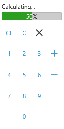
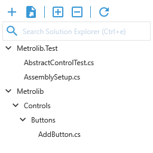

# Metrolib

This library offers many restyled controls that help building a slick WPF app.

https://www.nuget.org/packages/Metrolib

# Examples

The following screenshots show off applications built with controls from this library. The sources for these examples can be found in the DocumentationCreator project.

**Calculator**:  
  

**Solution Explorer**:  
  

# Controls

This library ships a lot of restyled controls, from buttons to full blown charts:

## Buttons
* [AddButton](Documentation/Metrolib.Controls.AddButton/README.md)
* [CloseButton](Documentation/Metrolib.Controls.CloseButton/README.md)
* [CollapseAllButton](Documentation/Metrolib.Controls.CollapseAllButton/README.md)
* [DownloadButton](Documentation/Metrolib.Controls.DownloadButton/README.md)
* [ExpandAllButton](Documentation/Metrolib.Controls.ExpandAllButton/README.md)
* [ExportButton](Documentation/Metrolib.Controls.ExportButton/README.md)
* [FlatButton](Documentation/Metrolib.Controls.FlatButton/README.md)
* [FileAddButton](Documentation/Metrolib.Controls.FileAddButton/README.md)
* [FolderAddButton](Documentation/Metrolib.Controls.FolderAddButton/README.md)
* [FolderOpenButton](Documentation/Metrolib.Controls.FolderOpenButton/README.md)
* [ImportButton](Documentation/Metrolib.Controls.ImportButton/README.md)
* [MaximizeButton](Documentation/Metrolib.Controls.MaximizeButton/README.md)
* [MinimizeButton](Documentation/Metrolib.Controls.MinimizeButton/README.md)
* [MoreButton](Documentation/Metrolib.Controls.MoreButton/README.md)
* [NextButton](Documentation/Metrolib.Controls.NextButton/README.md)
* [PreviousButton](Documentation/Metrolib.Controls.PreviousButton/README.md)
* [RefreshButton](Documentation/Metrolib.Controls.RefreshButton/README.md)
* [RemoveButton](Documentation/Metrolib.Controls.RemoveButton/README.md)
* [SearchButton](Documentation/Metrolib.Controls.SearchButton/README.md)
* [TrashButton](Documentation/Metrolib.Controls.TrashButton/README.md)
* [UndoButton](Documentation/Metrolib.Controls.UndoButton/README.md)
* [UploadButton](Documentation/Metrolib.Controls.UploadButton/README.md)

## Toggle Buttons
* [AlarmToggleButton](Documentation/Metrolib.Controls.AlarmToggleButton/README.md)
* [EditToggleButton](Documentation/Metrolib.Controls.EditToggleButton/README.md)
* [EmailToggleButton](Documentation/Metrolib.Controls.EmailToggleButton/README.md)
* [ExpanderToggleButton](Documentation/Metrolib.Controls.ExpanderToggleButton/README.md)
* OneWayToggle
* [PluginToggleButton](Documentation/Metrolib.Controls.PluginToggleButton/README.md)
* [ViewDashboardToggleButton](Documentation/Metrolib.Controls.ViewDashboardToggleButton/README.md)
* [ViewQuiltToggleButton](Documentation/Metrolib.Controls.ViewQuiltToggleButton/README.md)
* [VisibilityToggleButton](Documentation/Metrolib.Controls.VisibilityToggleButton/README.md)

## Text Boxes
* [EditorTextBox](Documentation/Metrolib.Controls.EditorTextBox/README.md)
* [FilterTextBox](Documentation/Metrolib.Controls.FilterTextBox/README.md)
* [FlatPasswordBox](Documentation/Metrolib.Controls.FlatPasswordBox/README.md)
* [PathChooserTextBox](Documentation/Metrolib.Controls.PathChooserTextBox/README.md)
* [SearchTextBox](Documentation/Metrolib.Controls.SearchTextBox/README.md)

## Progress Bars
* [FlatProgressBar](Documentation/Metrolib.Controls.FlatProgressBar/README.md)
* [CircularProgressBar](Documentation/Metrolib.Controls.CircularProgressBar/README.md)

## Item Controls
* FlatListView
* FlatTreeView
* FlatTabControl

## Charts
* [LineChart](Documentation/LineChart/README.md)
* [PieChart](Documentation/PieChart/README.md)
* [NetworkView](Documentation/NetworkView/README.md)
* MapView

## Other
* ChromelessWindow
* FlatExpander
* FlatScrollViewer
* FlatScrollBar
* FlatGroupBox

## License

[MIT](http://opensource.org/licenses/MIT)
