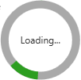

# CircularProgressBar

CircularProgressBar is a ProgressBar meant to visualise how a task has progressed.

```xaml
<metrolib:CircularProgressBar Minimum="0"
                              Maximum="100"
                              Value="61"
                              Content="Loading..." />
```


```xaml
<metrolib:CircularProgressBar IsIndeterminate="True"
                              Content="Loading..." />
```
