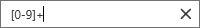

# EditorTextBox

FilterTextBox is a TextBox meant to allow a user to enter a filter expression.
The expression can be easily removed via a button which is only visible when an expression has been entered.
If the expression happens to be invalid (via the FilterTextBox.IsValid dependency property), then the background
switches to red. Determining the latter is responsibility of users of FilterTextBox (i.e. usually the ViewModel)

```xaml
<metrolib:FilterTextBox FilterText="[0-9]+" Watermark="Enter a filter!" IsValid="False" />
```





