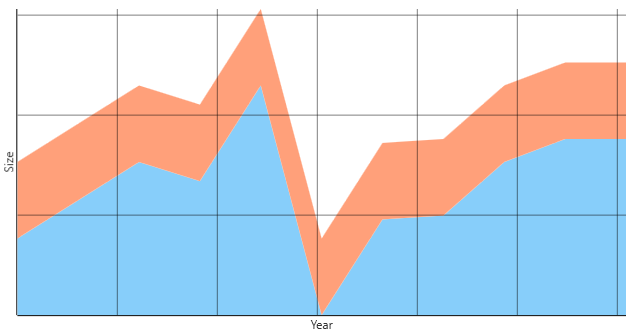

# LineChart

LineChart is a chart meant to visualise one or more series of points where each series is represented by a line.

The following example shows how to use a LineChart to present two series:
```xaml
<metrolib:LineChart ChartType="Stacked">
	<metrolib:LineChart.Series>
		<x:Array Type="metrolib:ILineSeries">
			<metrolib:LineSeries PointRadius="5"
								 PointFill="DeepSkyBlue"
								 Fill="LightSkyBlue">
				<metrolib:LineSeries.Values>
					<x:Array Type="Point">
						<Point X="0" Y="0" />
						<Point X="1" Y="0.5" />
						<Point X="2" Y="1" />
						<Point X="3" Y="0.75" />
						<Point X="4" Y="2" />
						<Point X="5" Y="-1" />
						<Point X="6" Y="0.25" />
						<Point X="7" Y="0.3" />
						<Point X="8" Y="1" />
						<Point X="9" Y="1.3" />
						<Point X="10" Y="1.3" />
					</x:Array>
				</metrolib:LineSeries.Values>
			</metrolib:LineSeries>
			<metrolib:LineSeries Fill="LightSalmon"
								 PointRadius="5"
								 PointFill="LightSalmon">
				<metrolib:LineSeries.Outline>
					<Pen Thickness="2" Brush="OrangeRed" />
				</metrolib:LineSeries.Outline>
				<metrolib:LineSeries.PointOutline>
					<Pen Thickness="2" Brush="OrangeRed" />
				</metrolib:LineSeries.PointOutline>
				<metrolib:LineSeries.Values>
					<x:Array Type="Point">
						<Point X="0" Y="1" />
						<Point X="1" Y="1" />
						<Point X="2" Y="1" />
						<Point X="3" Y="1" />
						<Point X="4" Y="1" />
						<Point X="5" Y="1" />
						<Point X="6" Y="1" />
						<Point X="7" Y="1" />
						<Point X="8" Y="1" />
						<Point X="9" Y="1" />
						<Point X="10" Y="1" />
					</x:Array>
				</metrolib:LineSeries.Values>
			</metrolib:LineSeries>
		</x:Array>
	</metrolib:LineChart.Series>
	<metrolib:LineChart.XAxis>
		<metrolib:AxisDefinition Caption="Year" />
	</metrolib:LineChart.XAxis>
	<metrolib:LineChart.YAxis>
		<metrolib:AxisDefinition Caption="Size" />
	</metrolib:LineChart.YAxis>
</metrolib:LineChart>
```

