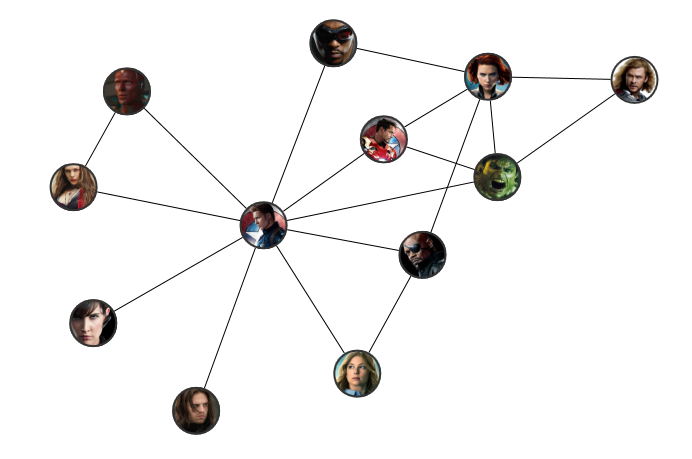

# NetworkView

NetworkView is a chart meant to visualise relationships between entities, modelled as a graph of nodes and edges.
A NetworkView takes an enumeration of nodes and edges and presents them on 2D plane.

The following example shows how to use a NetworkView to present the relationship between Avengers:
```xaml
<metrolib:NetworkView Nodes="{Binding Avengers}"
                      Edges="{Binding SelectedEdges}"
                      x:Name="Chart">
    <metrolib:NetworkView.Layout>
        <metrolib:ForceDirectedLayout Repulsiveness="8000" />
    </metrolib:NetworkView.Layout>
    <metrolib:NetworkView.NodeTemplate>
        <DataTemplate DataType="{x:Type sample:MarvelCharacterViewModel}">
            <Image Source="{Binding Portrait}"
                   Width="48"
                   Height="48"
                   RenderOptions.BitmapScalingMode="HighQuality"
                   ToolTip="{Binding Name}" />
        </DataTemplate>
    </metrolib:NetworkView.NodeTemplate>
</metrolib:NetworkView>
```


