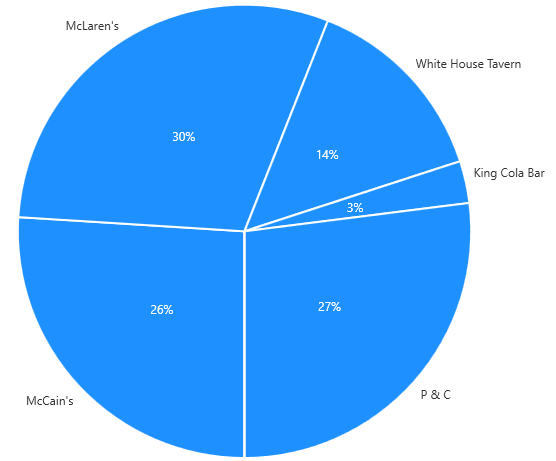

# PieChart

PieChart is a chart meant to visualise the proportions of several scalar values.
A PieChart takes an IPieSeries that consists of several IPieSlices where each slice contains the scalar
value being represented by that slice.

The following example shows how to use a PieChart to present my favourite bars
```xaml
<metrolib:PieChart>
	<metrolib:PieChart.Outline>
		<Pen Thickness="1" Brush="Black" />
	</metrolib:PieChart.Outline>
	<metrolib:PieChart.ValueTemplate>
		<DataTemplate>
			<TextBlock Text="{Binding}" Foreground="White" />
		</DataTemplate>
	</metrolib:PieChart.ValueTemplate>
	<metrolib:PieChart.Series>
		<metrolib:PieSeries>
			<metrolib:PieSeries.Slices>
				<metrolib:PieSlice Label="McCain's" Value="26" DisplayedValue="26%" Outline="{StaticResource SliceOutline}" />
				<metrolib:PieSlice Label="McLaren's" Value="30" DisplayedValue="30%" Outline="{StaticResource SliceOutline}" />
				<metrolib:PieSlice Label="White House Tavern" Value="14" DisplayedValue="14%" Outline="{StaticResource SliceOutline}" />
				<metrolib:PieSlice Label="King Cola Bar" Value="3" DisplayedValue="3%" Outline="{StaticResource SliceOutline}" />
				<metrolib:PieSlice Label="P &amp; C" Value="27" DisplayedValue="27%" Outline="{StaticResource SliceOutline}" />
				<metrolib:PieSlice Label="Puzzles" Value="0" DisplayedValue="1%" Outline="{StaticResource SliceOutline}" />
			</metrolib:PieSeries.Slices>
		</metrolib:PieSeries>
	</metrolib:PieChart.Series>
</metrolib:PieChart>
```


